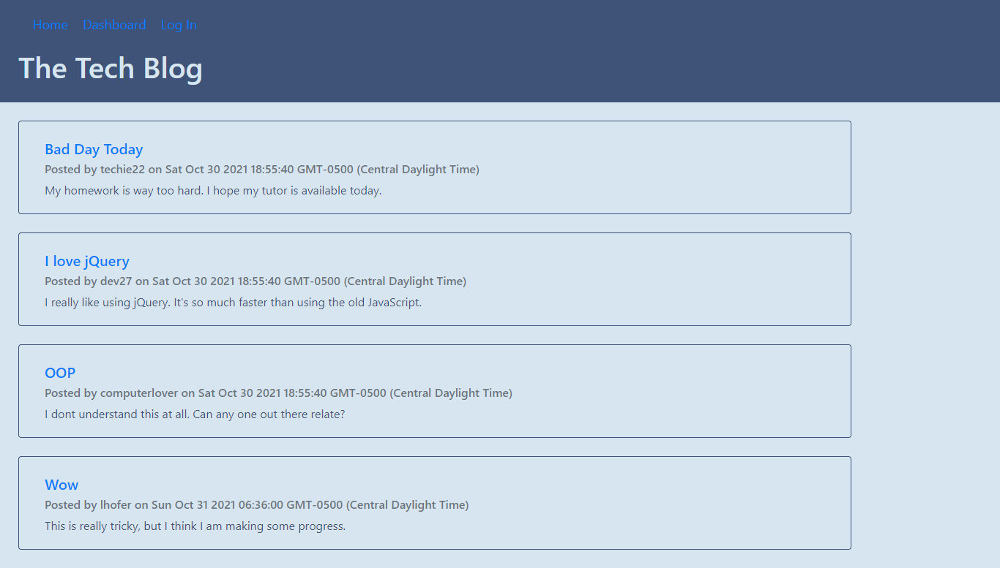

# MVC Tech Blog
Bootcamp Homework #14

## Description 
I have created a Tech Blog that facilitates communication between developers. In the dashboard users can see all blog posts and comments. Once signed up and logged in users can comment on blog post, create, update, and delete their posts. 
    
## Table of Contents

- [Installation](#installation)
- [Usage](#usage)
- [License](#license)
- [Contributions](#contributions)
- [Link](#link) 
- [Technologies](#technologies)
- [Questions](#questions)

## Installation
This application requires Node therefore users should run "npm install" in their command line prior to use. 

## Usage
Here is a screen shot of the landing page for the app:

## License
This project licensed under the [MIT License](https://opensource.org/licenses/MIT).

## Contributions
Please contact me at <ljhofer@gmail.com> to discuss contributions.

## Link
[Link to deployed on Heroku.](https://ljhofer-tech-blog.herokuapp.com/)

[Link to project's GitHub repo.](https://github.com/ljhofer/mvc-tech-blog)

## Technologies
The program uses HTML, CSS, Bootstrap, JavaScript, Node, Express 

## Questions
Please email any questions to <ljhofer@gmail.com> or reference my [GitHub profile](https://github.com/ljhofer). 